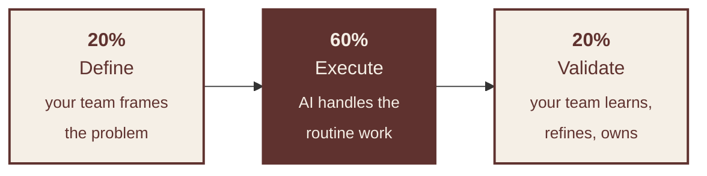

**Iberian AI consultancy** · Headquartered in Aveiro
[proportione.com](https://proportione.com) · [engineering.proportione.com](https://engineering.proportione.com) · [voxelers.com](https://voxelers.com) · [LinkedIn](https://www.linkedin.com/company/proportione)

---

<table width="100%">
<tr>
<td align="center" width="33%">

### 20+ years
building AI systems

</td>
<td align="center" width="33%">

### 5 years
as Proportione

</td>
<td align="center" width="33%">

### 2 cities
Aveiro · Madrid

</td>
</tr>
</table>

---

## Strategy is the work

Most AI initiatives fail at the people layer, not the model layer. We were shipping recommender systems before machine learning was a board-level acronym, training teams on GPT-3 twenty months before ChatGPT, and operating production AI agents today. Proportione, founded in 2021, is what twenty years of that work made possible.

Our practice is built around three vectors: **strategy** — where AI actually creates leverage; **research** — applied work, publications, and a doctoral programme at the Universidade de Aveiro; and **engineering discipline** — the controls that turn pilots into production.

---

## The 20·60·20 framework

Seventy percent of transformations fail because of people, not technology. The 20·60·20 framework keeps human intelligence at the boundaries of every workflow — defining what matters and validating what works — while AI takes the routine middle. It is the only configuration we have seen consistently produce sticky outcomes.

---

## Featured project

### [Aviaria Civil](https://civil.proportione.com) — Bird-strike risk for civil aviation

Real-time bird-hazard intelligence for pilots and small aerodromes. Twenty-two risk layers (eBird, GBIF, migration corridors, power lines, terrain), route analysis over CORINE land cover, PWA installable on iPad in the cockpit, offline-ready. Built in collaboration with Spain's BACSI (Air & Space Force bird-strike committee). **Free for civil aviation operators.**

→ [civil.proportione.com](https://civil.proportione.com)

---

## What we publish

<table>
<tr>
<td width="50%" valign="top">

### [prisma](https://github.com/Proportione/prisma)

A Python toolkit for systematic literature reviews. PRISMA 2020 reporting, MMAT 2018 quality assessment, full-text extraction, bibliometric clustering. CLI + Streamlit demo. Born from our doctoral research at UA.

`MIT` · `research` · `prisma-2020` · `python`

</td>
<td width="50%" valign="top">

### Research line

Doctoral research at **Universidade de Aveiro** in *Business Innovation*, working at the intersection of generative AI and organisational change. Field notes on the engineering blog.

`PhD` · `research`

</td>
</tr>
<tr>
<td width="50%" valign="top">

### [proportione-plugins](https://github.com/Proportione/proportione-plugins)

Our internal Claude Code marketplace, opened to clients. Nine quality skills — deep review, security, architecture, performance, WordPress, Terraform — and eight playbooks distilled from production work.

`MIT` · `claude-code` · `mcp`

</td>
<td width="50%" valign="top">

### [claude-code-showcase](https://github.com/Proportione/claude-code-showcase)

Configurations, hooks, slash commands, and MCP patterns we use daily. Reusable material for teams bringing agentic AI into production.

`MIT` · `agentic-ai` · `showcase`

</td>
</tr>
<tr>
<td width="50%" valign="top">

### [voxelers-3d](https://github.com/Proportione/voxelers-3d)

Voxel-native 3D stack — Blender, MagicaVoxel, Godot, procedural generation. The geometric primitive behind our digital-twin and creative work. See [voxelers.com](https://voxelers.com).

`Apache-2.0` · `digital-twin` · `voxels`

</td>
<td width="50%" valign="top">

### [engineering.proportione.com](https://engineering.proportione.com)

Engineering blog. Post-mortems, architecture decisions, and applied research from the team — written in English, for technical audiences.

`Jekyll` · `publications`

</td>
</tr>
<tr>
<td width="50%" valign="top">

### [porqueViven](https://github.com/Proportione/porqueViven)

Open-source work with the porqueViven foundation. Tooling for caregivers of chronically ill children — pro-bono engineering, public license.

`MIT` · `third-sector`

</td>
<td width="50%" valign="top">

### [Café Proportione PT](https://open.spotify.com/show/4CJj2IGBwpbxpyPTFmt3je)

Podcast em português sobre IA, indústria e ecossistemas ibéricos. Episódio 01: *dois anos em Aveiro, em silêncio*. [Spotify](https://open.spotify.com/show/4CJj2IGBwpbxpyPTFmt3je) · [YouTube](https://youtu.be/af5ZztGznl4)

`pt-PT` · `podcast` · `Aveiro`

</td>
</tr>
</table>

---

## How we operate

Every change is peer-reviewed under branch protection. Production deploys require manual approval in a separate environment. Every decision is in the audit log. Our clients do not depend on a person — they depend on a process that can be inspected, reproduced, and where appropriate, opened.

[Issues](https://github.com/Proportione/proportione-plugins/issues) · [Discussions](https://github.com/Proportione/proportione-plugins/discussions) · [Security policy](https://github.com/Proportione/proportione-plugins/blob/main/SECURITY.md)

---

## Where we are

**Aveiro, Portugal** — Rua D. Jorge de Lencastre 10A
Madrid presence · Iberian footprint · LATAM-ready

---

[**proportione.com/contact**](https://proportione.com/contacto)

